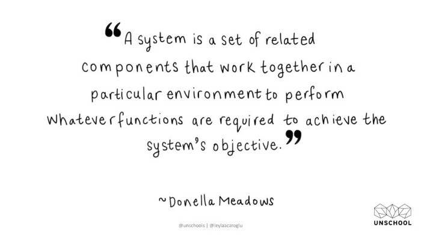
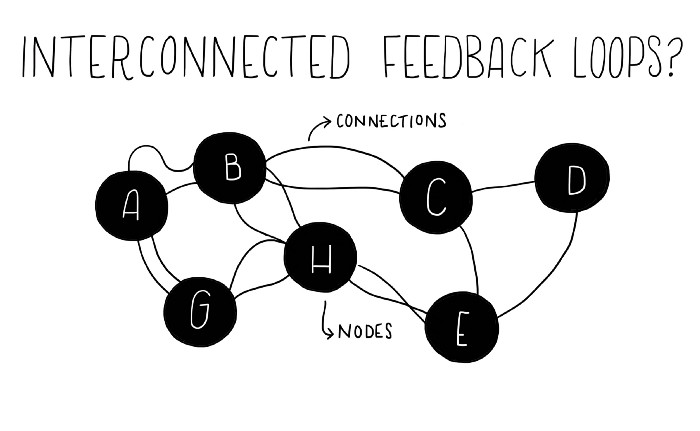
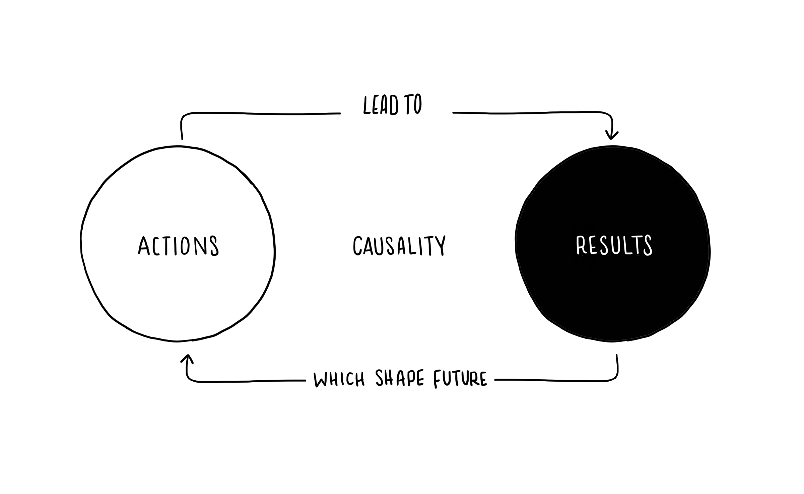

<!-- markdownlint-disable MD045 -->

Source: [Tools for Systems Thinkers: The 6 Fundamental Concepts of Systems Thinking](https://medium.com/disruptive-design/tools-for-systems-thinkers-the-6-fundamental-concepts-of-systems-thinking-379cdac3dc6a)

## Interconnectedness

Systems thinking requires a shift in mindset, away from linear to circular. The fundamental principle of this shift is that everything is interconnected. We talk about interconnectedness not in a spiritual way, but in a biological sciences way.

Essentially, everything is reliant upon something else for survival. Humans need food, air, and water to sustain our bodies, and trees need carbon dioxide and sunlight to thrive. Everything needs something else, often a complex array of other things, to survive.

Inanimate objects are also reliant on other things: a chair needs a tree to grow to provide its wood, and a cell phone needs electricity distribution to power it. So, when we say ‘everything is interconnected’ from a systems thinking perspective, we are defining a fundamental principle of life. From this, we can shift the way we see the world, from a linear, structured “mechanical worldview’ to a dynamic, chaotic, interconnected array of relationships and feedback loops.
A systems thinker uses this mindset to untangle and work within the complexity of life on Earth.

## Synthesis

In general, synthesis refers to the combining of two or more things to create something new. When it comes to systems thinking, the goal is synthesis, as opposed to analysis, which is the dissection of complexity into manageable components. Analysis fits into the mechanical and reductionist worldview, where the world is broken down into parts.

But all systems are dynamic and often complex; thus, we need a more holistic approach to understanding phenomena. Synthesis is about understanding the whole and the parts at the same time, along with the relationships and the connections that make up the dynamics of the whole.

Essentially, synthesis is the ability to see interconnectedness.

## Emergence

From a systems perspective, we know that larger things emerge from smaller parts: emergence is the natural outcome of things coming together. In the most abstract sense, emergence describes the universal concept of how life emerges from individual biological elements in diverse and unique ways.

Emergence is the outcome of the synergies of the parts; it is about non-linearity and self-organization and we often use the term ‘emergence’ to describe the outcome of things interacting together.

A simple example of emergence is a snowflake. It forms out of environmental factors and biological elements. When the temperature is right, freezing water particles form in beautiful fractal patterns around a single molecule of matter, such as a speck of pollution, a spore, or even dead skin cells.

Conceptually, people often find emergence a bit tricky to get their head around, but when you get it, your brain starts to form emergent outcomes from the disparate and often odd things you encounter in the world.

> There is nothing in a caterpillar that tells you it will be a butterfly — R. Buckminster Fuller

## Feedback Loops

Since everything is interconnected, there are constant feedback loops and flows between elements of a system. We can observe, understand, and intervene in feedback loops once we understand their type and dynamics.

The two main types of feedback loops are reinforcing and balancing. What can be confusing is a reinforcing feedback loop is not usually a good thing. This happens when elements in a system reinforce more of the same, such as population growth or algae growing exponentially in a pond. In reinforcing loops, an abundance of one element can continually refine itself, which often leads to it taking over.

A balancing feedback loop, however, is where elements within the system balance things out. Nature basically got this down to a tee with the predator/prey situation — but if you take out too much of one animal from an ecosystem, the next thing you know, you have a population explosion of another, which is the other type of feedback — reinforcing.

## Causality

Understanding feedback loops is about gaining perspective of causality: how one thing results in another thing in a dynamic and constantly evolving system (all systems are dynamic and constantly changing in some way; that is the essence of life).

Cause and effect are pretty common concepts in many professions and life in general — parents try to teach this type of critical life lesson to their young ones, and I’m sure you can remember a recent time you were at the mercy of an impact from an unintentional action.

Causality as a concept in systems thinking is really about being able to decipher the way things influence each other in a system. Understanding causality leads to a deeper perspective on agency, feedback loops, connections and relationships, which are all fundamental parts of systems mapping.

## Systems Mapping

Systems mapping is one of the key tools of the systems thinker. There are many ways to map, from analog cluster mapping to complex digital feedback analysis. However, the fundamental principles and practices of systems mapping are universal. Identify and map the elements of ‘things’ within a system to understand how they interconnect, relate and act in a complex system, and from here, unique insights and discoveries can be used to develop interventions, shifts, or policy decisions that will dramatically change the system in the most effective way.

