<!-- markdownlint-disable MD025 MD045 MD012 -->
# Systems Thinking - ganz praktisch

 Egal ob es um die Situation in Deinem **Team**, die **Firma** in der Du arbeitest, Deine persönliche Weiterentwicklung oder um große **globale Themen** geht: Sich „ein Bild“ von der Welt zu machen ist nicht einfach. Um komplexe Systeme und deren Wirkzusammenhänge zu verstehen, existieren eine Reihe **mentale Modelle** und zugehörigen Visualisierungstechniken.

Wir werden ausgewählte – z. B. Ladder of Inference, **Causal Loop Diagrams**, **Current Reality Trees und Future Reaility Trees** – kennenlernen und sie auf praktische Alltagssituationen anwenden. Nach dem Workshop werdet ihr „eure Systeme“ wieder ein bisschen gezielter beeinflussen und verbessern können.

---

<!-- backgroundColor: lightblue -->
# 🤹 What makes you complex as a living system?

# 🧑🏻‍🤝‍🧑🏼 What kind of system is your team, your company?

---

<!-- backgroundColor: default -->
# Some Logistics

* 3x70 minutes, with breaks
* This is a PowerPoint free session 🤪
* All material in English (Really?)
* [Our Miro board](https://miro.com/app/board/o9J_llN-cwY=/)
* [Our Github repo](https://github.com/thomykay/devspace-systemsthinking)
* We are all experts. We are all learners.
  
---

# What is a System?

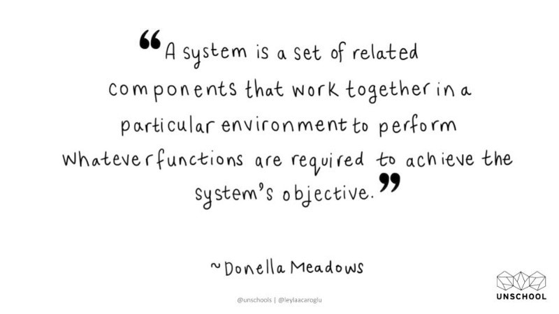

---

# What is Systems Thinking?

* is the ability or skill to perform problem solving in complex system
* Systems thinking is your ability to see things as a whole (or holistically) including the many different types of relationships between the many elements in a complex system.

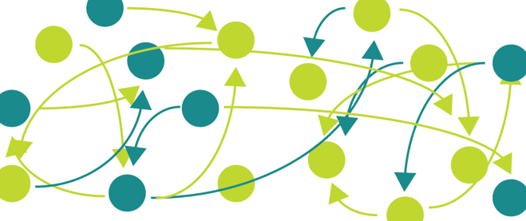

> The same old thinking will create the same old results, thus we need to start by changing our way of thinking and looking at the world.

---

# Systems Thinking - The Domains

Source: [Systems Innovation Guide](https://www.systemsinnovation.io/post/systems-innovation-guide)
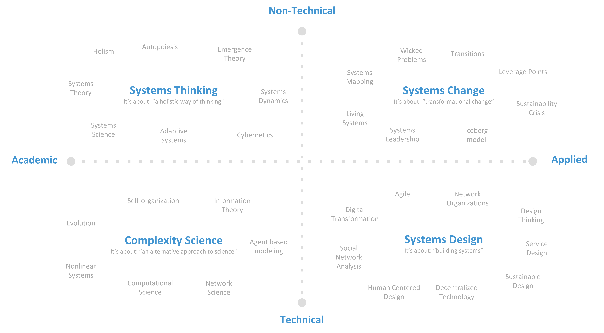

---

# Systems Thinking - The Timeline

Source: [Systems Innovation Guide](https://www.systemsinnovation.io/post/systems-innovation-guide)
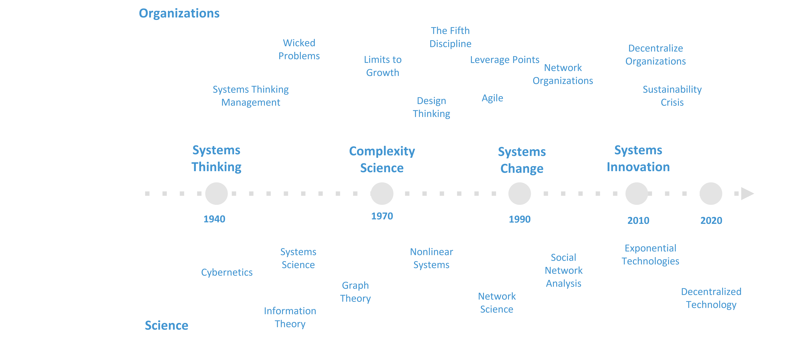

---

# Tools - 6 Fundamental Concepts of Systems Thinking

See: [Details](https://github.com/thomykay/devspace-systemsthinking/blob/main/src/material/tools-of-a-systems-thinker.md)

---

# The Fifth Disciplin - The Book

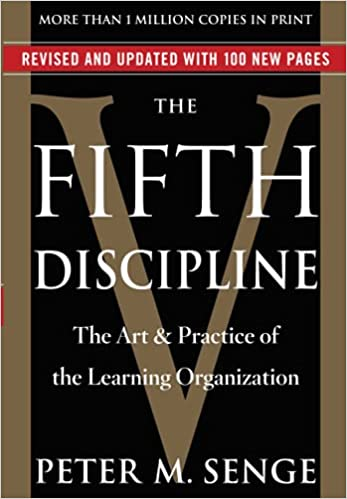
Peter Senge, 1990

Idea of "The Learning Organization"

---

# The Five Diciplines

See: [Details](https://github.com/thomykay/devspace-systemsthinking/blob/main/src/material/the-fifth-discipline.md)

---
<!-- backgroundColor: default -->
# Current Reality Tree

...is a tool to **analyze** many systems or organizational problems at once. By **identifying root causes** common to most or all of the problems, a CRT can greatly aid focused improvement of the system. A current reality tree is a **directed graph**.

---

# Current Reality Tree (CRT) - Structure

---

# Undesirable Effects (UDE)

“An UDE is essentially the first indication you have that something might be amiss in the system. It is something that really exists and is negative on its own merits.” – William Dettmer, The Logical Thinking Processes, 2007

* Examples
  * Employee morale is low
  * Decreasing profit
  * Attrition is increasing
  * byo…

---
<!-- backgroundColor: lightblue -->
# UDE Excercise - Team from Hell

Source: [Solving Problems with Theory of Constraints, CRTs @ Lean Agile Edinburgh](https://www.slideshare.net/lazallen/solving-problems-with-theory-of-constraints-current-reality-trees-lean-agile-edinburgh)

|Time|What|How|
|--|--|--|
|🕜3min|Individually: Note **7 things that drive you crazy** about team work
|🕜10min|Share the lists with each other.|*Bingo*...|
|🕜6min|As a 'new team', what are your top 5?|
|🕜10min|Share horror stories about each person's experience with Teams From Hell.||

---

# UDE Debrief

* 🪢 What reminded you of you day-to-day?
* 💬 What did this teach you about great communication?
* 🎯 How did you align on the goal?

---

<!-- backgroundColor: default -->
# Apropos "Team from Hell" - Team Dysfunctions

---

<!-- backgroundColor: default -->
# Reading a CRT (1)

---

# Reading a CRT (2)

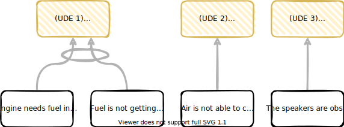

---

# Reading a CRT (3)

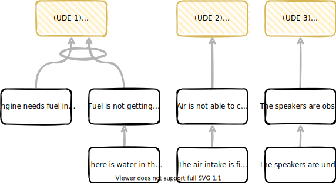

---

# Reading a CRT (4)

---
<!-- backgroundColor: lightblue -->
# CRT Exercise - Team from Hell

Starting with the collected UDEs, build the CRT for the “Team from Hell”.

|Time|What|How|
|--|--|--|
|🕜10min|Identify intermediate effects and how they are related||
|🕜...| Can you identify any root causes? Which?|
|🕜5min|As a group, prepare to read through your CRT|

---

# CRT - Debrief

* 💬 Doing it again, how would you communicate differently?
* 👌 How did you organize yourselves as a team?
* 🎬 What does this experience remind you of in your day-to-day?

---

<!-- backgroundColor: default -->
# CRT - Reading (Extra)

Source: [Scrutinizing and improving a Logical Current Reality Tree](https://www.youtube.com/watch?v=NVrEt6hDJVM&t=65s)

Unoptimized             |  Optimized
:-------------------------:|:-------------------------:
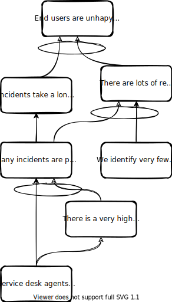  |  

---

# Future Reality Tree

is a **visualization of a desired, improved future state**. ... A FRT usually follows an analysis with a Current Reality Tree and other visual analysis methods.

---
<!-- backgroundColor: default -->
# Future Reality Tree (FRT)

---

# Injection

* An injection is a new condition or action that does not exist in the current reality. It is something **you must make happen** in order for the future reality to unfold the way you want it to

---

# Negative Branches

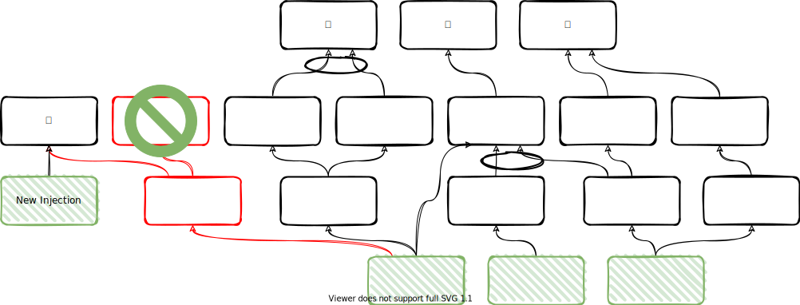

---
<!-- backgroundColor: lightblue -->
# FRT Exercise - Team from Hell

How can we escape the hell with our team - into a bright future 🌞?

|Time|What|
|--|--|
|🕜7min|What would the **desirable effects** be in the FRT?||
|🕜7min|Can you think about any possible **injections** to address the root causes?
|🕜...|Optional: Think about one of your injections and write down a possible **negative branch** for that injection (no need to trim it). 

---

# FRT - Debrief

* 👌 Did something unpredictable happen? What was unpreditable?
* 🎬 What did you learn about yourself and the team?
* 💚 What else would you like to share?

---

<!-- backgroundColor: default -->
# Break

---

# What is a Mental Model?

A mental model is an **explanation of how something works**. The phrase “mental model” is an overarching term for any sort of concept, framework, or worldview that you carry around in your mind.

Mental models help you **understand life**.

Source: [Mental Models: Learn How to Think Better and Gain a Mental Edge](https://jamesclear.com/mental-models)

---

# 5 Mental Models

---
<!-- backgroundColor: lightblue -->
# Exercise - 5 Mental Models
You are the experts. Prepare a short 3min talk for the whole group, explain your model.
* What's the essence of the model?
* What are the core take aways of the model?
* What possible applications do you see to see or change your world?
  
|Time|What|
|--|--|
|🕜3min|Organize the team, how do you process the material?|
|🕜15min|Read the material, share what you understood|
|🕜10min|Shape the talk, test it

---

# Debrief - Mental Models

* 💬 Doing it again, how would you communicate differently?
* 🪢 What ideas, innovation or changes emerged?
* 🎬 What are you more aware of now?

---

<!-- backgroundColor: default -->
# Break
---

# Causal Loop Diagrams (CLD)

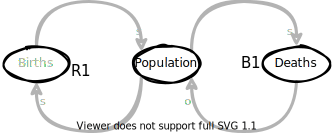
aid in visualizing how different variables in a system are causally interrelated. The diagram consists of a set of words and arrows. Causal loop diagrams are accompanied by a narrative which describes the causally closed situation the CLD describes.

---

# Causal Loop Diagrams (CLD) - Structure

---

# CLD - Example Population

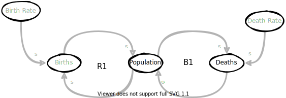

How can you read this CLD?

---

# CLD - Example Population (2)

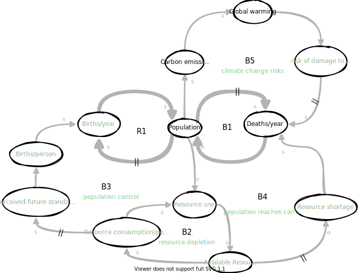

Source: [How Systems Create Their Own Behavior](https://systemsandus.com/2016/12/26/how-systems-create-their-own-behavior/)

---

# CLD - Building a CLD - Before you start

Source: [Systems Thinking mit Causal-Loop-Diagrammen](https://agilecoach.de/wissen/systems-thinking-mit-causal-loop-diagrammen/)

* What are the aspects and boundaries of the system in focus?
* What's the detail level we want to look at?

* ➡️ Don't try to build "the whole system" from the beginning
* Which problem are we looking at with the model to be created?

> Example: "We observe again and again that we have to push a lot of short-cycle hotfixes after each release. This causes a lot of stress in the teams and our users are obviously not really satisfied either. Let's try to model these problems in a causal loop diagram."

---

# Building a CLD (1) - Identify System Variables

* What variables are there in our system that might have something to do with our problem?
* ➡️ Be precise in naming the variables, ideally make them quantitative

---

# Building a CLD (2) - Dynamics and changes of system variables

* What relation can be established between individual system variables?
* Do two system variables influence each other directly or are other variables involved?
* Which other aspects play a role in the environment of an identified variable?

---

# Building a CLD (3) - Reinforcement and weakening of system variables

* If variable A changes upward, that is, becomes stronger, higher, or more in its expression, how does variable B change?

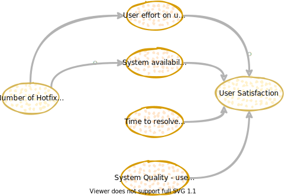

---

# Building a CLD (4) - Delayed influence of system variables

* Add additional influences, causes and identify delays in the process

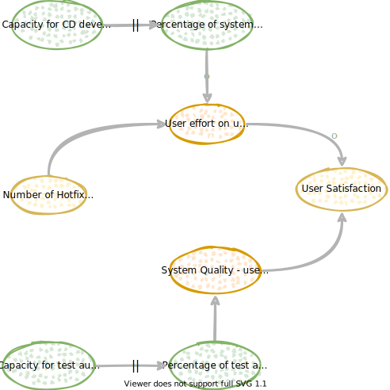

---
<!-- backgroundColor: lightblue -->
# CLD - Exercise

Build an initial CLD from a problem/challenge you are facing within your team/project (5 scenarios)

|Time|What|
|--|--|
|🕜5min|Explain your scenario. The team makes notes (Identify System Variables)|
|🕜15min|🧑🏻‍🤝‍🧑🏼Find relations and more aspects, consider reinforcement and weakening relations|
|🕜10min|🧑🏻‍🤝‍🧑🏼Can you find delays, identify loops in the scenario?

---

# CLD - Exercise - Debrief

* 🎬 What would an expert make of your experience?
* 👌 How was the participation distributed?
* 🎯 What was most challenging?

---
<!-- backgroundColor: default -->
# CLD - Debrief

Source: [Identifying the “right” interventions in the wicked complexity of the COVID-19 pandemic](https://realkm.com/2020/08/07/identifying-the-right-interventions-in-the-wicked-complexity-of-the-covid-19-pandemic/)

---

# Addendum - CLD Archetypes

Source: [Tools for Systems Thinkers: The 12 Recurring Systems Archetypes](https://medium.com/disruptive-design/tools-for-systems-thinkers-the-12-recurring-systems-archetypes-2e2c8ae8fc99)

Archetypes are recurring patterns of behavior that give insights into the structures that drive systems. They offer a way of deciphering systems dynamics across a diversity of disciplines, scenarios, or contexts.

Think of these archetypes as the **storylines of systems in the world**. Just as you can identify the same formula for a romcom or a thriller in a Hollywood film, these archetypes help systems thinkers see behaviors and flows in more concrete terms.

---

# Archetypes - Example - Fixes that Fail

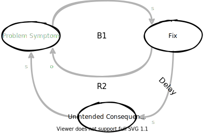

a “quick-fix” solution can have unintended consequences that exacerbate the problem. It hypothesizes that the problem symptom will diminish for a short while and then return to its previous level, or become even worse over time.

For more, [see here](../material/system%20archetypes.md).

---

# Archetypes

* Drifting Goals
* Escalation
* Fixes That Fail
* Growth and Underinvestment
* Limits to Success
* Shifting the Burden
* Successful to the Successful
* Tradegy of the Commons

See [Details](../material/system%20archetypes.md)

---
<!-- backgroundColor: lightblue -->
# Checkout

## What has been my highest high and lowest low from this project/workshop/session?

## What's my biggest insight from today?

---

<!-- backgroundColor: default -->
# 🙏Thank you🙏